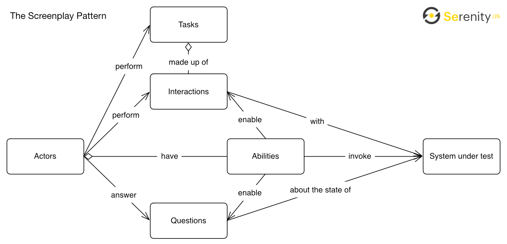

# Test Automation Framework Documentation

This document describes the architecture of the test automation framework created for the PetClinic application.

## Framework Overview

### Technologies

The framework was created using the following technologies:

- Java 21
- Maven
- Serenity BDD
- Cucumber
- Testcontainers
- Docker
- Selenium
- RestAssured
- GitHub Actions
- Screenplay pattern

### Structure

In the framework, the Screenplay pattern was used to create the tests. This pattern allows the creation of tests that
are easy to read and maintain. The Screenplay pattern is based on the following concepts:

- Actors: Represent the users/systems that interact with the application
- Tasks: Represent the actions performed by the actors in order to achieve a goal
- Questions: Represent the information retrieved from the application, used to verify the state of the application
- Facts: Represent preconditions for the actors

more information about the Screenplay pattern can be
found [here](https://serenity-bdd.github.io/docs/screenplay/screenplay_fundamentals)
or [here](https://serenity-js.org/handbook/design/screenplay-pattern/)

The framework is divided into the following packages:

- `features`: Contains the Cucumber scenarios
- `tasks`: Contains the tasks used by the actors to interact with the application
- `questions`: Contains the questions that represent the information retrieved from the application
- `facts`: Contains the facts that represents preconditions for the actors
- `ui`: Contains the classes that represent the user interface of the application
- `models`: Contains the classes that represent the abstractions of the application entities, I have models that
  represents the Requests or Responses of the API, but also entities that represents the data shown in the UI

### Features and Scenarios

The features and scenarios were created using the Gherkin syntax. The scenarios are written in a way that they can be
understood by all stakeholders, not only the technical team. The scenarios are focused on the expected behavior of the
application, not on the implementation details. Only API scenarios use implementation details to express the expected
response codes and messages.

These are the features created:

- [manage_owners.feature](src/test/resources/features/owners/manage_owners.feature): Contains the scenarios related to
  the management of owners, like listing, editing, and deleting owners.
- [filter_owners.feature](src/test/resources/features/owners/filter_owners.feature): Contains the scenarios related to
  the filtering of owners using different fields in the UI.
- [owners_registration.feature](src/test/resources/features/owners/owners_registration.feature): Contains the scenarios
  related to the registration of new owners.
- [pets_management.feature](src/test/resources/features/pets/pets_management.feature): Contains the scenarios related to
  the management of pets, like registering, editing, and listing pets.
- [visits_management.feature](src/test/resources/features/visits/visits_management.feature): Contains the scenarios
  related to the management of visits, like registering and listing visits.
- [view_veterinarians.feature](src/test/resources/features/veterinarians/view_vet_data.feature): Contains the
  scenarios related to the listing of veterinarians.

### Test Execution

For the test execution, the tests are executed in parallel to provide a quick feedback loop. The tests are executed in
a headless mode by default, but it's possible to run the tests in a non-headless mode by setting the `headless.mode`
property
to `false`.

The framework uses [Testcontainers](https://www.testcontainers.com/) to start the application in a Docker container, so
there is no need to manually start the application before running the tests.
There are 2 possible scenarios when starting the application:

1. The test will use a global Docker container for the application, this is when test is not affected by the execution
   of other tests.
2. The test will use a Docker container linked to the feature file, this is when the tests inside the feature file are
   dependent on some data creation and could be affected by the execution of other scenarios.

### Test Reporting

When the tests finish, a report is generated in the `target/site/serenity` folder. To access the report, open the
`index.html` file in a browser.

This report contains all the information about the test execution, like the scenarios executed, the steps performed, and
the results of the tests. If the scenario is a Web test, the report will contain screenshots of the application on each
step. If the scenario is an API test, the report will contain the request and response information.

The report will also contain the overall test results, like the number of scenarios executed, the number of scenarios
that
passed, and the number of scenarios that failed. Also information about the environment where the tests were executed,
and the capabilities of the browser used in the execution.

### GitHub Actions

I used GitHub Actions to run the tests in a CI/CD pipeline. The pipeline is defined in
the [build_and_test.yml](.github/workflows/build_and_test.yml) file. The pipeline is triggered when a push is made to
the main branch, when a pull request is created or can be triggered manually. The pipeline will run the tests in a
headless mode by default, but it's possible to run the tests in a non-headless mode by setting the `headless.mode`
input.

The pipeline will publish the test report in [GitHub Pages](https://ricardorlg.github.io/VetClinicTests/).

